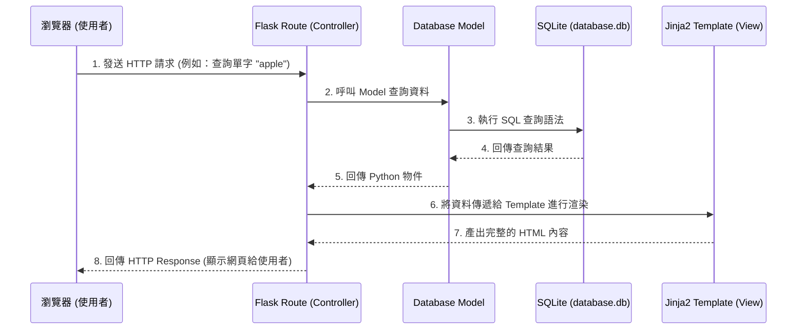

# 系統架構設計 - 英文單字系統

## 1. 技術架構說明

本專案採用傳統的伺服器端渲染 (Server-Side Rendering) 架構，不採用前後端分離，以降低 MVP 階段的開發與維護成本。

- **後端框架：Python + Flask**
  - **原因：** Flask 是一個輕量級的 Python Web 框架，適合快速開發中小型應用程式，學習曲線平緩，彈性高。
- **模板引擎：Jinja2**
  - **原因：** Flask 內建支援 Jinja2，能輕鬆地將後端資料動態渲染到 HTML 頁面上，減少前後端溝通成本，適合以內容呈現為主的網頁應用。
- **資料庫：SQLite**
  - **原因：** SQLite 是輕量級的關聯式資料庫，不需要獨立架設資料庫伺服器，資料直接存在本地檔案中，非常適合這個專案的規模。

### MVC 模式對應說明
在我們的 Flask 專案中，架構與 MVC (Model-View-Controller) 設計模式的概念對應如下：
- **Model (資料模型)：** 負責與 SQLite 資料庫溝通，定義資料表結構（例如：單字表、使用者表、收藏紀錄），並處理資料的增刪改查 (CRUD)。
- **View (視圖)：** 負責畫面的結構與呈現，也就是 Jinja2 的 HTML 模板 (`templates/`)。它會接收來自 Controller 的資料並渲染成最終的網頁。
- **Controller (控制器)：** 負責處理商業邏輯與流程控制，對應到 Flask 的路由函式 (`routes/`)。它負責接收使用者的 HTTP 請求、呼叫 Model 存取資料，最後將結果傳遞給 View。

## 2. 專案資料夾結構

建議採用以下模組化的結構，將不同職責的程式碼分開，方便團隊分工與日後維護：

```text
web_app_development2/
├── app/                      # 應用程式主目錄 (Package)
│   ├── __init__.py           # Flask app 初始化、註冊 Blueprint 與設定
│   ├── models/               # [Model] 資料庫模型
│   │   ├── __init__.py
│   │   └── models.py         # 單字、使用者、收藏等資料結構定義
│   ├── routes/               # [Controller] Flask 路由處理
│   │   ├── __init__.py
│   │   ├── main_routes.py    # 首頁、查詢、翻譯等核心路由
│   │   └── user_routes.py    # 個人單字本、測驗等使用者相關路由
│   ├── templates/            # [View] Jinja2 HTML 模板
│   │   ├── base.html         # 共用版型 (標頭、導覽列、頁尾等)
│   │   ├── index.html        # 首頁 / 查詢與列表頁面
│   │   ├── add_word.html     # 新增單字頁面
│   │   ├── collection.html   # 個人單字本頁面
│   │   └── quiz.html         # 單字測驗頁面
│   └── static/               # 靜態資源檔案
│       ├── css/
│       │   └── style.css     # 網頁樣式表
│       ├── js/
│       │   └── main.js       # 前端互動邏輯 (如需要)
│       └── images/           # 圖片與圖示資源
├── instance/                 # 存放環境特定或機密檔案 (不進入版控)
│   └── database.db           # SQLite 資料庫檔案
├── docs/                     # 專案文件
│   ├── PRD.md                # 產品需求文件
│   └── ARCHITECTURE.md       # 系統架構文件 (本文件)
├── requirements.txt          # Python 依賴套件清單
└── run.py                    # 專案啟動入口程式
```

## 3. 元件關係圖

以下展示使用者從瀏覽器發出請求後，系統內部各元件的處理流程：



## 4. 關鍵設計決策

1. **採用套件模組化組織 (Package Structure)：**
   不把所有的程式碼都寫在同一個 `app.py` 中，而是將路由、模型、視圖分門別類放在 `app/` 目錄下。這讓開發前端、後端的組員能專注在不同的資料夾中工作，減少衝突。
2. **共用基礎模板 (Base Template)：**
   在 `templates/base.html` 中定義共用的 HTML 骨架（如：載入 CSS、網站標題、導覽列）。其他子頁面透過 Jinja2 的 `` 來繼承，大幅減少重複程式碼並確保全站設計風格一致。
3. **資料庫檔案獨立存放 (instance 目錄)：**
   將 `database.db` 放在 `instance/` 資料夾中。這個資料夾內的檔案通常會被設定在 `.gitignore` 內不進入版本控制，避免團隊成員的測試資料互相覆蓋。
4. **使用 Flask Blueprint 管理路由：**
   為了避免所有的路由都塞在同一個檔案裡，我們設計了 `main_routes.py` 和 `user_routes.py`。未來可以透過 Flask 的 Blueprint 機制將它們註冊到主程式中，讓程式碼更清晰易讀。
