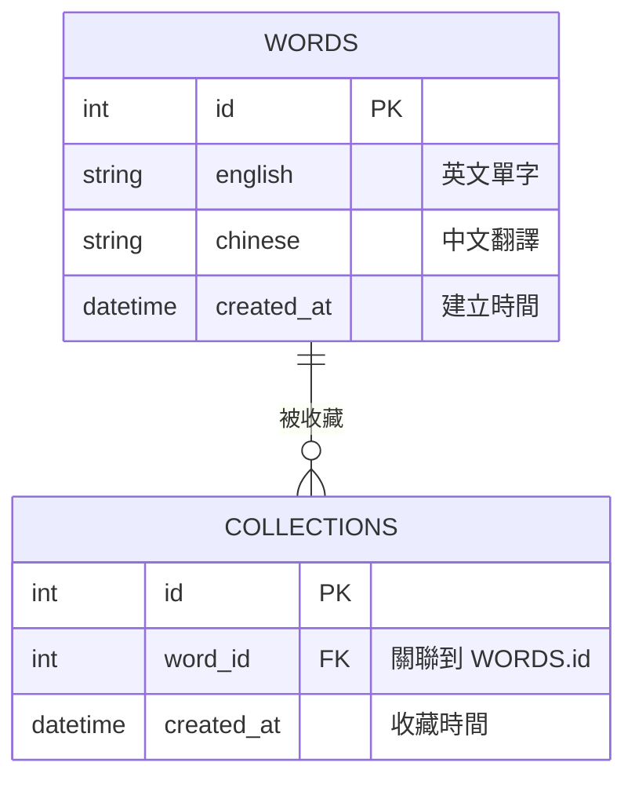

# 資料庫設計 - 英文單字系統

本文件詳細說明系統的資料庫設計，包含實體關係圖 (ER Diagram)、資料表欄位定義，以及針對 MVP 範圍的結構設計。

## 1. ER 圖 (實體關係圖)

> **備註：** 在第一階段 MVP 中，由於尚未實作使用者登入系統，`COLLECTIONS` (收藏庫) 暫時視為共用的單一單字本。未來實作多帳號時，只需在此表加入 `user_id` 欄位即可區分不同使用者的收藏。

## 2. 資料表詳細說明

### WORDS (單字表)
儲存系統內所有的單字與翻譯。
| 欄位名稱 | 型別 | 必填 | 預設值 | 說明 |
|---|---|---|---|---|
| `id` | INTEGER | 是 | (PK, Auto) | 唯一識別碼 |
| `english` | TEXT | 是 | - | 英文單字 |
| `chinese` | TEXT | 是 | - | 中文翻譯 |
| `created_at` | DATETIME | 是 | CURRENT_TIMESTAMP | 單字加入系統的時間 |

### COLLECTIONS (收藏庫)
紀錄使用者加入「個人單字本」的單字。
| 欄位名稱 | 型別 | 必填 | 預設值 | 說明 |
|---|---|---|---|---|
| `id` | INTEGER | 是 | (PK, Auto) | 唯一識別碼 |
| `word_id` | INTEGER | 是 | - | 關聯到 `WORDS` 表的 `id` (Foreign Key) |
| `created_at` | DATETIME | 是 | CURRENT_TIMESTAMP | 收藏時間 |

## 3. SQL 建表語法
完整的 SQLite 建表語法請參考 `database/schema.sql`。

## 4. Python Model 程式碼
我們採用 Python 內建的 `sqlite3` 模組來實作資料庫操作，不依賴龐大的 ORM 套件，以保持 MVP 的輕量化。Model 程式碼已放置於 `app/models/` 目錄中：
- `app/models/db.py`: 負責資料庫連線與初始化邏輯。
- `app/models/word_model.py`: 負責單字的增刪改查 (CRUD) 與關鍵字搜尋。
- `app/models/collection_model.py`: 負責收藏庫的加入、移除與測驗用的隨機抽取。
