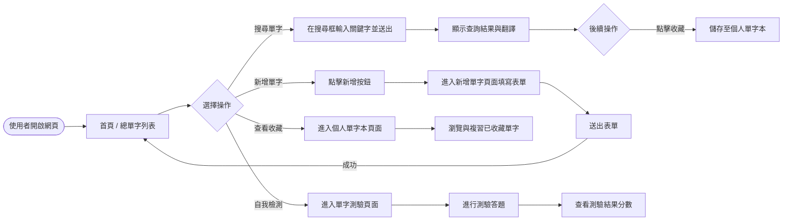
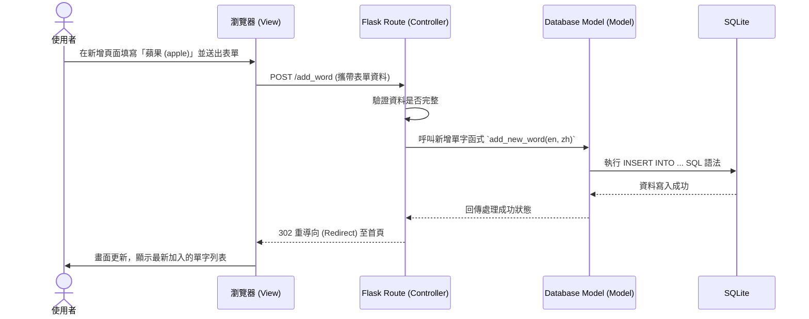

# 流程圖設計 - 英文單字系統

本文件根據產品需求文件 (PRD) 與系統架構，將使用者的操作路徑與系統內部的資料流動視覺化，確保功能設計沒有遺漏。

## 1. 使用者流程圖 (User Flow)

這張圖展示了使用者（學生或老師）進入網站後，可以進行的各種操作路徑：

## 2. 系統序列圖 (Sequence Diagram)

以下以**「使用者新增單字」**這個核心功能為例，展示從前端瀏覽器發出請求，到後端 Flask 與 SQLite 處理資料的完整互動過程：

## 3. 功能清單對照表

根據上述流程，系統預計需要以下的路徑 (URL) 與 HTTP 方法來實作對應功能：

| 功能名稱 | URL 路徑 | HTTP 方法 | 說明 |
|---|---|---|---|
| 首頁 / 單字列表 | `/` | GET | 顯示系統內所有的單字清單 |
| 查詢與翻譯單字 | `/search` | GET | 透過 Query String `?q=keyword` 查詢單字 |
| 新增單字 (頁面) | `/add_word` | GET | 顯示新增單字的填寫表單 |
| 新增單字 (處理) | `/add_word` | POST | 接收表單資料並存入資料庫 |
| 個人單字本 (列表) | `/collection` | GET | 顯示使用者收藏的單字清單 |
| 加入收藏 (處理) | `/collection/add` | POST | 接收單字 ID 並將其加入使用者的收藏庫 |
| 單字測驗 (頁面) | `/quiz` | GET | 顯示隨機出題的單字測驗頁面 |

這份文件有助於我們在接下來的「資料庫設計」與「API / 路由設計」階段，確保所有需要存取的資料與路徑都已規劃妥當。
